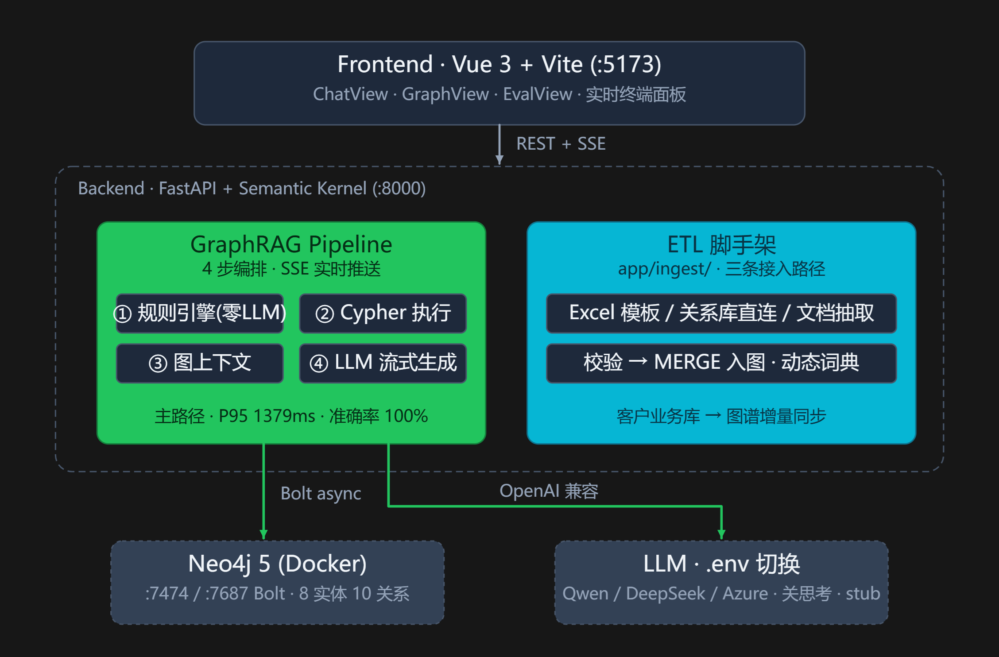
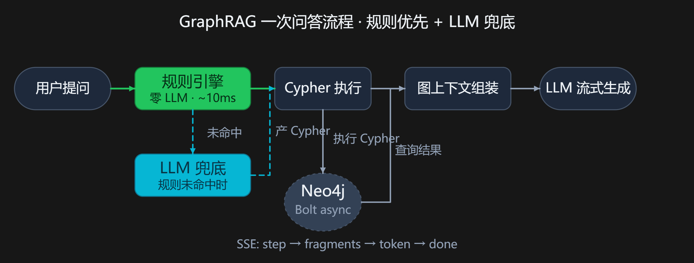
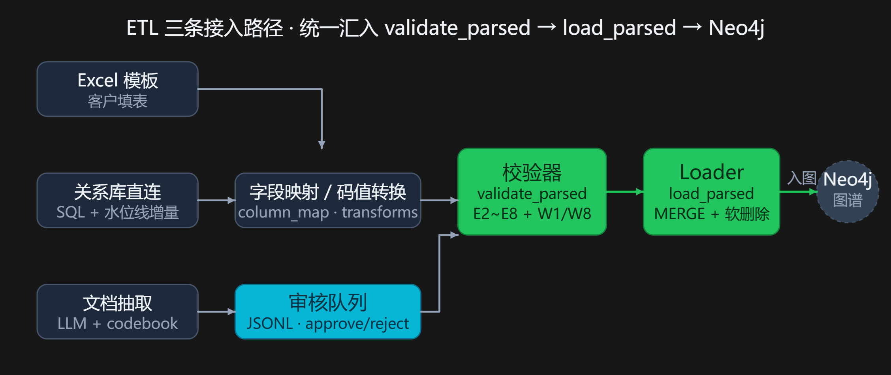
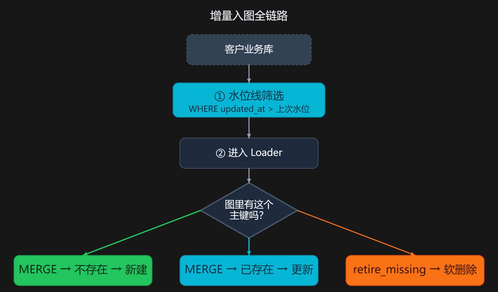

# PurifierGraph · 净水器售后知识图谱 GraphRAG 助手

[English](README.md) | 中文

> 知识图谱 + 规则引擎 + LLM 的售后"关系型问答"—— Neo4j 多跳检索 · 规则引擎优先零 LLM · 221 用例 × 3 模型全链路评估。

      

用 **知识图谱 + 规则引擎 + LLM** 回答净水器售后里的"关系型问题"：滤芯兼容、故障排查、批次召回。并提供一套从客户业务库/Excel/文档到图谱的 ETL 脚手架。

> **全链路实测（221 条×3 模型，2026-09）**：DeepSeek / Qwen / gpt-4.1-mini 质量打平（门户 judge Pass ≈90%），实体完整率 ≈55%；DeepSeek 最快 P95 **1288ms**。

---

## 一、什么是 GraphRAG？

**普通 RAG** 把文档切片做向量检索，擅长"文档里写了什么"，但回答不了需要跨多条关系推理的问题：

> "BATCH-2024C 批次召回，影响了哪些客户的订单？该怎么处理？"

这要沿图谱走 3 跳：`批次 → 订单 → 客户 → 处理方案`。向量检索把关系"打散"在文本里，拼不回来。

**GraphRAG** 把知识整理成**图**（节点 = 事物，关系 = 事物之间的联系），提问时生成一条**图查询语句（Cypher）**精确取回子图，再让 LLM 组织成人话回答。

```
普通 RAG：  问题 ──向量检索──> 几段文字 ──> LLM 总结
GraphRAG：  问题 ──实体/意图──> Cypher 查图 ──> 精确子图 ──> LLM 组织语言
```

净水器售后天然是一张关系网（型号用哪些滤芯、故障由什么原因引起、批次影响了谁），所以适合 GraphRAG。

---

## 二、总体架构



| 层 | 技术 |
|---|---|
| 前端 | Vue 3 · Vite 5 · TypeScript · Element Plus · vis-network |
| 后端 | Python 3.11 · FastAPI · Semantic Kernel · sse-starlette |
| 图谱 | Neo4j 5 Community（Docker）· async Bolt 驱动 |
| LLM | Qwen / DeepSeek / Azure OpenAI，`.env` 切换，混合推理模型已关思考 |
| ETL | openpyxl · sqlite3/mysql-connector/oracledb（关系库可选） |

---

## 三、GraphRAG 问答流程

以 **"PG-A100 不出水可能是什么原因？"** 为例，后端走 4 步流水线：



### 第 1 步：实体抽取 + Cypher 生成 —— 规则引擎优先，零 LLM

`SmartEntityCypherPlugin` 先走**规则引擎**（`app/llm/rules.py`）：

1. **抽实体**：优先走**动态实体词典**（从 Neo4j 实时加载编码表 + 症状进前缀树），未就绪回退正则
2. **关键词判意图**：问句含"不出水/原因" → `fault_diagnosis` 场景
3. **症状匹配故障**：问句含症状文本 → 精确定位故障编码
4. **查模板库**：`(意图, 实体组合)` → 预写好的 Cypher 模板

规则没覆盖的问法才回退到 LLM（一次调用同时产出实体和 Cypher），保证"不崩"。

### 第 2 步：执行 Cypher（零 LLM）

`CypherExecutor` 拿模板查 Neo4j，毫秒级返回记录。

### 第 3 步：组装图上下文（零 LLM）

`GraphContext` 把每条记录包装成"引用片段"（前端默认折叠、点击展开），序列化成 JSON 喂给 LLM。

### 第 4 步：LLM 流式生成回答（唯一的 LLM 调用）

`LLMGeneration` 基于图上下文生成中文回答，逐 token 经 SSE 推给前端。

### P95 < 2s 的关键手段

| 手段 | 效果 |
|---|---|
| 规则引擎替代第一次 LLM 调用 | 实体+Cypher ~2500ms → **~10ms** |
| 只保留一次 LLM 调用（生成答案） | 省 ~1.3s |
| 关闭混合推理模型思考模式 | 1.6~3.7s → **~850ms** |

---

## 四、知识图谱 Schema

### 节点（8 类实体）

| 标签 | 关键属性 |
|---|---|
| Model 型号 | name, series, release_year |
| Filter 滤芯 | code, type, lifespan_months |
| Fault 故障 | code, symptom |
| Cause 原因 | description |
| Solution 方案 | description, cost |
| Customer 客户 | id, name, region |
| Order 订单 | id, date, status |
| Batch 批次 | id, manufacture_date, recall_status |

### 关系（10 类）

```
(:Model)-[:USES]->(:Filter)                型号使用滤芯
(:Model)-[:HAS_FAULT]->(:Fault)            型号存在故障
(:Fault)-[:CAUSED_BY]->(:Cause)            故障由原因导致
(:Cause)-[:SOLVED_BY]->(:Solution)         原因由方案解决
(:Solution)-[:REQUIRES_FILTER]->(:Filter)  方案需更换滤芯
(:Customer)-[:PLACED]->(:Order)            客户下单
(:Order)-[:CONTAINS]->(:Model)             订单包含型号
(:Order)-[:FROM_BATCH]->(:Batch)           订单来自批次
(:Batch)-[:PRODUCES]->(:Model)             批次生产型号
(:Batch)-[:AFFECTS]->(:Filter)             批次影响滤芯
```

三类业务场景与多跳路径：

| 场景 | 典型问题 | 图上路径 |
|---|---|---|
| 滤芯兼容 | PG-A100 能用哪些滤芯？ | Model → USES → Filter |
| 故障排查 | PG-A100 不出水什么原因？ | Model → Fault → Cause → Solution → Filter |
| 批次召回 | BATCH-2024C 影响哪些客户？ | Batch ← Order ← Customer + Solution |

---

## 五、从客户数据到图谱（ETL 脚手架）

生产环境客户的真实数据分散在 ERP/MES/CRM 数据库、Excel 表、维修手册文档里。`app/ingest/` 提供三条接入路径，**输出统一结构，共用同一个校验器和加载器**。

### 首次建图



- **Excel 模板**：`registry.py`（单一数据源：8 实体 + 10 关系）驱动生成带列头/批注/枚举下拉/示例行的 Excel
- **回收校验**：必填/类型/枚举/编码正则/重复/端点存在等（E2~E8 错误 + W1/W8 警告）
- **关系库直连**：`sources/relational.py` 通用引擎，换 MySQL/Oracle/SQL Server 只需替换 `_connect`；`column_map` 客户列名 → 图谱 key，`transforms` 码值转换
- **文档抽取**：LLM 闭集抽取 + codebook 注入 → 审核工作台（JSONL 队列）→ approve 后自动入图
- **入图**：`load_parsed()` MERGE upsert + 打来源标签 + 悬空边检测

### 增量同步



**水位线**是增量同步的核心机制：

- `state.json` 记录每次同步各表的**上次拉取时间戳**
- 下次同步时，SQL 自动追加 `WHERE updated_at > 上次水位`，只拉新/改行
- 拉完后取结果集最大值推进水位线

**MERGE upsert 的三种结果**：

| 场景 | 主键在图里 | 动作 |
|---|---|---|
| 新增 | 不存在 | 新建节点，SET 全部属性 + 四标签（`_source`/`_batch_id`/`_updated_at`/`_lifecycle=active`） |
| 更改 | 已存在 | SET 更新**非空**属性（空值不覆盖已有），刷新 `_updated_at` |
| 软删除 | 本次没出现 + 同源 | SET `_lifecycle = inactive`，节点**保留不物理删**（下游工单/批次关系不能断） |

### 动态实体词典（替代硬编码正则）

入图后 `entity_dict.load_from_graph()` 从 Neo4j 全量加载所有节点编码 + 故障症状进前缀树，规则引擎立即可识别客户自定义编码（如 `HX-RO-800G`、`PC20250301`）。TTL 5 分钟自动过期刷新。

### 端到端 Demo

```bash
cd backend
set PYTHONPATH=.
python scripts/mockdb_demo.py            # 全流程：建客户库→SQL→ETL→Cypher→GraphRAG→增量
python scripts/mockdb_demo.py --clean    # 清理 demo 数据
```

---

## 六、全链路评估（221 条用例）

- **用例来源**：`generate_cases.py` 程序化生成 204 条 + 17 条手工边界用例
- **数据**：`backend/data/eval/eval_data_{provider}.jsonl`，每行 19 字段（query/response/context/cypher + 四阶段耗时 + token + 状态 + 场景元信息），由 [generate_eval_data.py](backend/scripts/generate_eval_data.py) 生成
- **两层评估**：Azure AI Foundry LLM-judge（主观语义）+ 本地精确指标（完整度/性能/成本）

### 6.1 Foundry 门户评估（已跑通全量）

[run_foundry_eval.py](backend/scripts/run_foundry_eval.py) 用三个**内置 RAG judge**（relevance 切题 / groundedness 防编造 / retrieval 检索相关，gpt-4.1-mini 当裁判，1–5 分判 Pass/Fail），221 条×3 模型全量完成、零 error：

| 模型 | Passed | Failed | Pass 率 |
|---|---|---|---|
| deepseek | 202/221 | 19 | **91.4%** |
| azure_openai (gpt-4.1-mini) | 201/221 | 20 | 90.9% |
| qwen | 199/221 | 22 | 90.0% |

### 6.2 本地精确指标（[compare_models.py](backend/scripts/compare_models.py) 产出）

```powershell
cd backend; set PYTHONPATH=.
python scripts/generate_eval_data.py --provider deepseek   # 或 qwen / azure_openai
python scripts/compare_models.py
```

**答案完整度**（弥补 judge"不查答全没"的盲区）：

| 指标 | deepseek | qwen | gpt-4.1-mini |
|---|---|---|---|
| keyword_hit（命中**任一**，最宽松） | 100% | 100% | 99.5% |
| entity_recall（平均实体覆盖率） | 76.4% | 77.0% | **78.5%** |
| completeness（期望实体**全部**命中，最严格） | 55.7% | 56.1% | 55.2% |

**检索 / 稳定性**（三模型同图同用例，一致）：context_hit 99.5% · context_recall 79.8% · 零结果率 0% · Cypher 合法率 100% · 错误率 0%。

**性能**（瓶颈全在 LLM 答案生成，Neo4j 查询仅 5ms）：

| 指标 | deepseek | qwen | gpt-4.1-mini |
|---|---|---|---|
| 端到端 mean | **736ms** | 1783ms | 1064ms |
| 端到端 P95 | **1288ms** | 2825ms | 1738ms |
| 端到端 max | 1601ms | ⚠️ 22823ms（离群） | 2369ms |
| TTFT mean | **469ms** | 871ms | 914ms |
| 每条 token | 362 | 379 | 390 |
| 全量估算成本 | — | — | ~$0.047 |

### 6.3 全链路结论

| 模型 | 质量 | 性能 | 判定 |
|---|---|---|---|
| **deepseek-v4-flash** | 打平（91.4% Pass） | **最快** P95 1.3s | 数据可出域时首选 |
| **gpt-4.1-mini** | 打平（90.9% Pass） | 居中 P95 1.7s | 必须留 Azure 时首选（全量成本 ~¥0.3） |
| qwen3.8-max | 打平（90.0% Pass） | **最慢** P95 2.8s + 22.8s 抖动 | 备选 |

**质量上三模型没有显著差异**；选型由**性能与部署合规**决定。瓶颈在答案生成阶段，Neo4j 多跳检索不是瓶颈。

### 6.4 评估工具链

| 脚本 | 作用 | 环境 |
|---|---|---|
| [generate_eval_data.py](backend/scripts/generate_eval_data.py) | 跑 pipeline 产出 19 字段评估数据 | `graphrag`（后端） |
| [compare_models.py](backend/scripts/compare_models.py) | 本地全链路指标 → CSV/JSON | `graphrag` |
| [run_foundry_eval.py](backend/scripts/run_foundry_eval.py) | 上传 Foundry 跑内置 judge → 门户对比 | `foundry`（独立，避免升级后端 openai） |

> `foundry` 环境依赖见 [requirements-foundry.txt](backend/requirements-foundry.txt)：`conda create -n foundry python=3.11 -y` 后 `pip install -r requirements-foundry.txt`。**不要**装进 graphrag 环境（azure-ai-projects 会强制升级 openai，弄坏后端）。

---

## 七、快速开始

### 前置条件

- Docker Desktop（Neo4j 容器）
- Python 3.11（conda 环境）
- Node.js 18+

```bash
# 创建 conda 环境（首次）
conda create -n graphrag python=3.11 -y
conda activate graphrag
pip install -r backend/requirements.txt
```

### 方式 A：Docker Compose 一键起

```bash
docker compose up -d --build
# Neo4j  http://localhost:7474   (neo4j / purifier123)
# 后端   http://localhost:8000/docs
# 前端   http://localhost:5173
```

### 方式 B：Windows 本地开发

双击 `runservice.bat`，自动开三个窗口：Neo4j（Docker）→ 后端（conda env `graphrag`）→ 前端（npm dev）。

### 方式 C：手动分步

```bash
# 1. Neo4j
docker compose up -d neo4j

# 2. 后端
cd backend
cp .env.example .env        # 填 LLM 配置（留空 = stub 模式）
set PYTHONPATH=.
uvicorn app.main:app --port 8000

# 3. 前端
cd frontend
npm install && npm run dev
```

### 种子数据 · Mock 数据

后端启动时 **自动导入种子数据**，`SEED_ON_STARTUP` 控制，默认 `True`。

手动跑客户 Mock 数据加载：

```bash
cd backend && set PYTHONPATH=.
python scripts/mockdb_demo.py            # 全流程：建客户库→ETL入图→增量同步
python scripts/mockdb_demo.py --clean    # 清理 demo 数据
```

### 配置 LLM（backend/.env）

```env
LLM_PROVIDER=deepseek          # qwen | deepseek | azure_openai

QWEN_ENDPOINT=...              QWEN_API_KEY=...      QWEN_MODEL=...
DEEPSEEK_ENDPOINT=...          DEEPSEEK_API_KEY=...  DEEPSEEK_MODEL=...
AZURE_OPENAI_ENDPOINT=...      AZURE_OPENAI_API_KEY=...  AZURE_OPENAI_DEPLOYMENT=...
```

endpoint/key 留空自动进入 **stub 模式**（本地假数据），无密钥也能联调前端。

---

## 八、界面截图

### 问答页


### 评估面板


### Azure AI Foundry


---

## 九、开源协议

本项目基于 [Apache License 2.0](LICENSE) 开源。

```
Copyright 2026 RebeccaZhou

Licensed under the Apache License, Version 2.0 (the "License");
you may not use this file except in compliance with the License.
You may obtain a copy of the License at

    http://www.apache.org/licenses/LICENSE-2.0

Unless required by applicable law or agreed to in writing, software
distributed under the License is distributed on an "AS IS" BASIS,
WITHOUT WARRANTIES OR CONDITIONS OF ANY KIND, either express or implied.
See the License for the specific language governing permissions and
limitations under the License.
```

