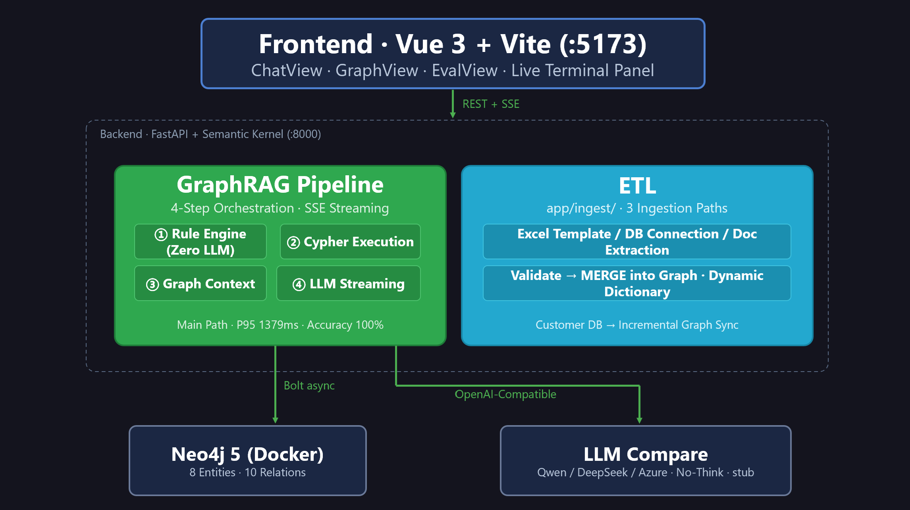
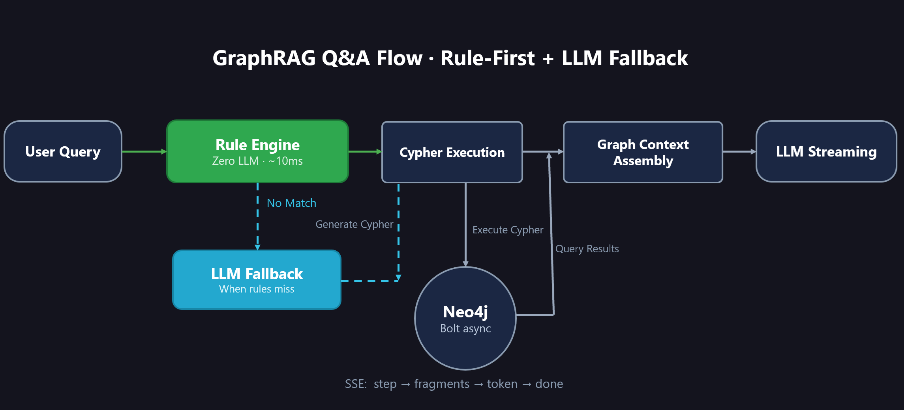
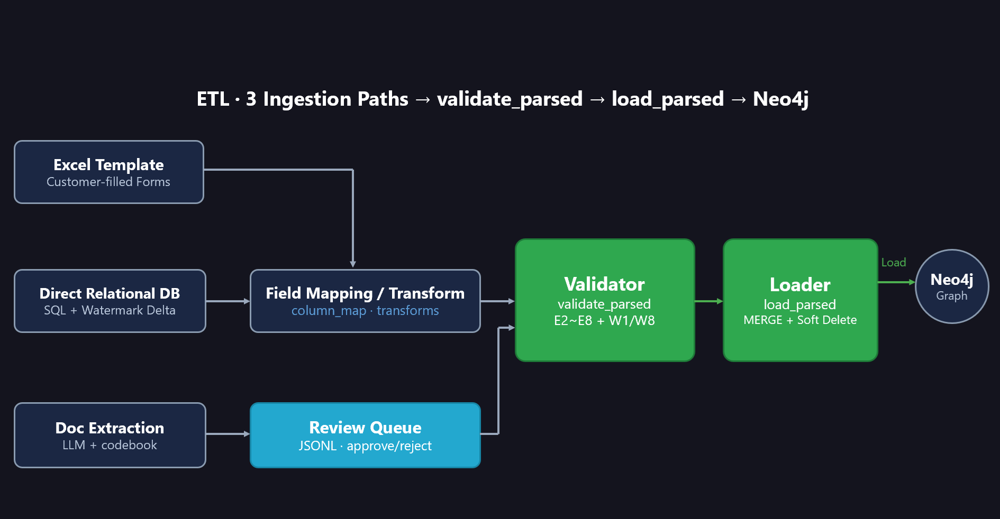
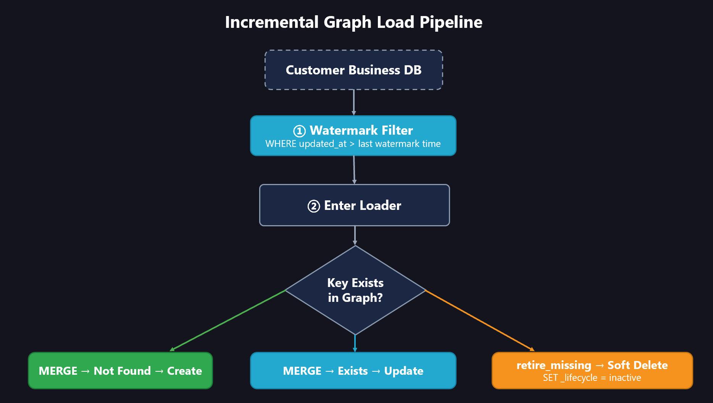
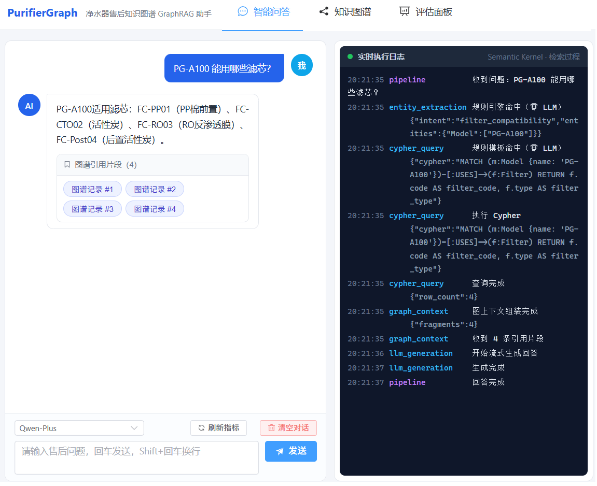
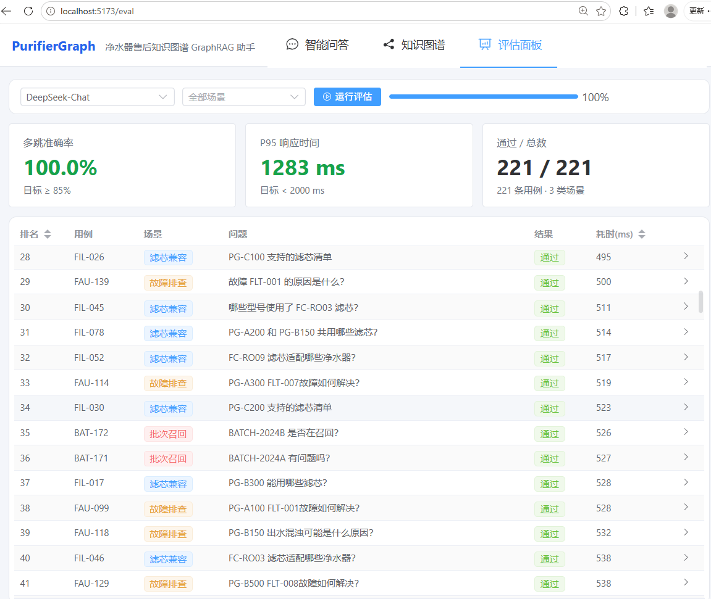
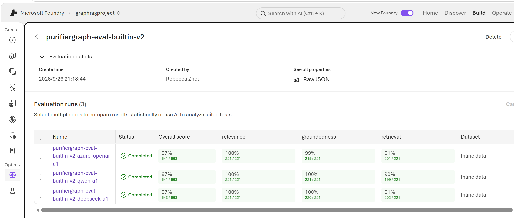

# PurifierGraph · Water Purifier After-Sales Knowledge-Graph GraphRAG Assistant

[中文](README-zh.md) | English

> Knowledge graph + rule engine + LLM for after-sales "relational QA" — Neo4j multi-hop retrieval · rule-engine-first (zero LLM) · 221-case × 3-model end-to-end evaluation.

      

Answers "relational questions" in water-purifier after-sales service — **filter compatibility, fault diagnosis, batch recall** — with a **Knowledge Graph + Rule Engine + LLM**. Also ships an ETL scaffold that turns customer business databases / Excel sheets / documents into the graph.

> **End-to-end benchmark (221 cases × 3 models, 2026-09)**: DeepSeek / Qwen / gpt-4.1-mini are statistically tied on quality (portal judge pass ≈90%; entity completeness ≈55%). DeepSeek is the fastest at **P95 1288ms**. 

---

## 1. What is GraphRAG?

**Plain RAG** chunks documents and does vector retrieval — good at "what the document says", but it cannot answer questions that require reasoning across multiple relations:

> "BATCH-2024C is recalled — which customers' orders are affected, and what should we do?"

That's a 3-hop walk on the graph: `Batch → Order → Customer → Remedy`. Vector retrieval shatters relations across text chunks and cannot stitch them back.

**GraphRAG** organizes knowledge as a **graph** (nodes = things, edges = relations). At query time it generates a **Cypher** statement to fetch the exact subgraph, then lets the LLM phrase a natural-language answer.

```
Plain RAG:  question ──vector search──> text chunks ──> LLM summarize
GraphRAG:   question ──entity/intent──> Cypher query ──> exact subgraph ──> LLM phrase answer
```

Water-purifier after-sales is naturally a relation web (models use filters, faults have causes, batches affect customers), which makes it a great GraphRAG fit.

---

## 2. Architecture



| Layer | Tech |
|---|---|
| Frontend | Vue 3 · Vite 5 · TypeScript · Element Plus · vis-network |
| Backend | Python 3.11 · FastAPI · Semantic Kernel · sse-starlette |
| Graph | Neo4j 5 Community (Docker) · async Bolt driver |
| LLM | Qwen / DeepSeek / Azure OpenAI, switched via `.env`; hybrid reasoning models run with thinking disabled |
| ETL | openpyxl · sqlite3/mysql-connector/oracledb (relational sources optional) |

---

## 3. GraphRAG QA Flow

Example: **"PG-A100 doesn't dispense water — what could be the cause?"** The backend runs a 4-step pipeline:



### Step 1: Entity extraction + Cypher generation — rule engine first, zero LLM

`SmartEntityCypherPlugin` uses the **rule engine** (`app/llm/rules.py`) first:

1. **Extract entities**: via the **dynamic entity dictionary** (a prefix trie loaded live from Neo4j code tables + symptoms), falling back to regex if not ready
2. **Classify intent by keywords**: e.g. "no water / cause" → `fault_diagnosis`
3. **Match symptom → fault**: symptom text maps to the exact fault code
4. **Look up templates**: `(intent, entity combination)` → pre-written Cypher template

Only out-of-coverage phrasings fall back to the LLM (one call produces both entities and Cypher), guaranteeing the pipeline never crashes.

### Step 2: Execute Cypher (zero LLM)

`CypherExecutor` runs the template against Neo4j, returning rows in milliseconds.

### Step 3: Assemble graph context (zero LLM)

`GraphContext` wraps each record into a "citation fragment" (collapsed by default in the UI, click to expand) and serializes them as JSON for the LLM.

### Step 4: LLM streams the answer (the only LLM call)

`LLMGeneration` writes the Chinese answer grounded on the graph context, streaming tokens to the frontend over SSE.

### How P95 < 2s is achieved

| Technique | Effect |
|---|---|
| Rule engine replaces the first LLM call | entity+Cypher ~2500ms → **~10ms** |
| Keep exactly one LLM call (answer generation) | saves ~1.3s |
| Disable thinking mode on hybrid reasoning models | 1.6–3.7s → **~850ms** |

---

## 4. Knowledge-Graph Schema

### Nodes (8 entity types)

| Label | Key properties |
|---|---|
| Model | name, series, release_year |
| Filter | code, type, lifespan_months |
| Fault | code, symptom |
| Cause | description |
| Solution | description, cost |
| Customer | id, name, region |
| Order | id, date, status |
| Batch | id, manufacture_date, recall_status |

### Relationships (10 types)

```
(:Model)-[:USES]->(:Filter)                model uses filter
(:Model)-[:HAS_FAULT]->(:Fault)            model has fault
(:Fault)-[:CAUSED_BY]->(:Cause)            fault caused by cause
(:Cause)-[:SOLVED_BY]->(:Solution)         cause solved by solution
(:Solution)-[:REQUIRES_FILTER]->(:Filter)  solution requires filter
(:Customer)-[:PLACED]->(:Order)            customer placed order
(:Order)-[:CONTAINS]->(:Model)             order contains model
(:Order)-[:FROM_BATCH]->(:Batch)           order from batch
(:Batch)-[:PRODUCES]->(:Model)             batch produces model
(:Batch)-[:AFFECTS]->(:Filter)             batch affects filter
```

The three business scenarios and their multi-hop paths:

| Scenario | Typical question | Graph path |
|---|---|---|
| Filter compatibility | Which filters fit PG-A100? | Model → USES → Filter |
| Fault diagnosis | PG-A100 dispenses no water — why? | Model → Fault → Cause → Solution → Filter |
| Batch recall | Which customers does BATCH-2024C affect? | Batch ← Order ← Customer + Solution |

---

## 5. From Customer Data to Graph (ETL Scaffold)

Real customer data lives in ERP/MES/CRM databases, Excel sheets, and maintenance manuals. `app/ingest/` provides three ingestion paths with **a unified output structure, shared validator and loader**.

### Initial graph build



- **Excel template**: generated from `registry.py` (single source of truth: 8 entities + 10 relations) with headers, comments, enum dropdowns, sample rows
- **Round-trip validation**: required/type/enum/code-regex/duplicates/endpoint existence (errors E2–E8, warnings W1/W8)
- **Relational DB direct connect**: `sources/relational.py` generic engine — swap MySQL/Oracle/SQL Server by replacing `_connect`; `column_map` maps customer columns to graph keys, `transforms` converts code values
- **Document extraction**: LLM closed-set extraction + codebook injection → review workbench (JSONL queue) → approve loads into the graph
- **Graph load**: `load_parsed()` MERGE upsert + source labels + dangling-edge detection

### Incremental sync



**Watermarks** are the core of incremental sync:

- `state.json` records each table's **last-pulled timestamp**
- Next sync appends `WHERE updated_at > last watermark` to the SQL, pulling only new/changed rows
- After the pull, the watermark advances to the result set's max value

**Three MERGE upsert outcomes**:

| Case | Primary key in graph? | Action |
|---|---|---|
| Insert | absent | create node, SET all props + four labels (`_source`/`_batch_id`/`_updated_at`/`_lifecycle=active`) |
| Update | present | SET **non-null** props only (nulls never overwrite), refresh `_updated_at` |
| Soft delete | missing this run + same source | SET `_lifecycle = inactive`, node **kept, never hard-deleted** (downstream orders/recall relations must not break) |

### Dynamic entity dictionary (replaces hardcoded regex)

After ingestion, `entity_dict.load_from_graph()` loads all node codes + fault symptoms from Neo4j into a prefix trie, so the rule engine immediately recognizes customer-defined codes (e.g. `HX-RO-800G`, `PC20250301`). TTL 5 minutes auto-refresh.

### End-to-end demo

```bash
cd backend
set PYTHONPATH=.
python scripts/mockdb_demo.py            # full flow: customer DB → SQL → ETL → Cypher → GraphRAG → incremental
python scripts/mockdb_demo.py --clean    # clean demo data
```

---

## 6. End-to-End Evaluation (221 cases)

- **Case source**: 204 programmatically generated by `generate_cases.py` + 17 hand-written edge cases
- **Data**: `backend/data/eval/eval_data_{provider}.jsonl`, 19 fields per row (query/response/context/cypher + per-stage latencies + tokens + status + scenario metadata), produced by [generate_eval_data.py](backend/scripts/generate_eval_data.py)
- **Two-layer evaluation**: Azure AI Foundry portal LLM-judge (subjective semantics) + local exact metrics (completeness / performance / cost / P95 end to end latency)

### 6.1 Foundry portal evaluation (full run complete)

[run_foundry_eval.py](backend/scripts/run_foundry_eval.py) uses three **built-in RAG judges** (relevance / groundedness / retrieval, gpt-4.1-mini as judge, 1–5 score → Pass/Fail). Full 221×3 run finished with **zero errors**:

| Model | Passed | Failed | Pass rate |
|---|---|---|---|
| deepseek | 202/221 | 19 | **91.4%** |
| azure_openai (gpt-4.1-mini) | 201/221 | 20 | 90.9% |
| qwen | 199/221 | 22 | 90.0% |

### 6.2 Local exact metrics (from [compare_models.py](backend/scripts/compare_models.py))

```powershell
cd backend; set PYTHONPATH=.
python scripts/generate_eval_data.py --provider deepseek   # or qwen / azure_openai
python scripts/compare_models.py
```

**Answer completeness** (fills the judge blind spot of "not checking whether the answer is complete"):

| Metric | deepseek | qwen | gpt-4.1-mini |
|---|---|---|---|
| keyword_hit (any hit, loosest) | 100% | 100% | 99.5% |
| entity_recall (mean entity coverage) | 76.4% | 77.0% | **78.5%** |
| completeness (all expected entities hit, strictest) | 55.7% | 56.1% | 55.2% |

**Retrieval / stability** (identical across models — same graph, same cases): context_hit 99.5% · context_recall 79.8% · zero-result rate 0% · Cypher validity 100% · error rate 0%.

**Performance** (bottleneck is entirely LLM answer generation; Neo4j queries take ~5ms):

| Metric | deepseek | qwen | gpt-4.1-mini |
|---|---|---|---|
| End-to-end mean | **736ms** | 1783ms | 1064ms |
| End-to-end P95 | **1288ms** | 2825ms | 1738ms |
| End-to-end max | 1601ms | ⚠️ 22823ms (outlier) | 2369ms |
| TTFT mean | **469ms** | 871ms | 914ms |
| Tokens per case | 362 | 379 | 390 |
| Full-run estimated cost | — | — | ~$0.047 |

### 6.3 End-to-end conclusions

| Model | Quality | Performance | Verdict |
|---|---|---|---|
| **deepseek-v4-flash** | tied (91.4% pass) | **fastest** P95 1.3s | first choice when data may leave Azure |
| **gpt-4.1-mini** | tied (90.9% pass) | middle P95 1.7s | first choice when data must stay on Azure (full run ~$0.05) |
| qwen3.8-max | tied (90.0% pass) | **slowest** P95 2.8s + 22.8s spike | backup |

### 6.4 Evaluation toolchain

| Script | Purpose | Environment |
|---|---|---|
| [generate_eval_data.py](backend/scripts/generate_eval_data.py) | run the pipeline, emit 19-field eval data | `graphrag` (backend) |
| [compare_models.py](backend/scripts/compare_models.py) | local end-to-end metrics → CSV/JSON | `graphrag` |
| [run_foundry_eval.py](backend/scripts/run_foundry_eval.py) | upload to Foundry, run built-in judges → portal comparison | `foundry` (isolated, to avoid upgrading the backend's openai) |

> `foundry` env deps: [requirements-foundry.txt](backend/requirements-foundry.txt) — `conda create -n foundry python=3.11 -y`, then `pip install -r requirements-foundry.txt`. Do **not** install into the graphrag env (azure-ai-projects force-upgrades openai and breaks the backend).


---

## 7. Quick Start

### Prerequisites

- Docker Desktop (Neo4j container)
- Python 3.11 (conda)
- Node.js 18+

```bash
# create conda env (first time)
conda create -n graphrag python=3.11 -y
conda activate graphrag
pip install -r backend/requirements.txt
```

### Option A: Docker Compose, one command

```bash
docker compose up -d --build
# Neo4j  http://localhost:7474   (neo4j / purifier123)
# Backend http://localhost:8000/docs
# Frontend http://localhost:5173
```

### Option B: Windows local dev

Double-click `runservice.bat` — it opens three windows: Neo4j (Docker) → backend (conda env `graphrag`) → frontend (npm dev).

### Option C: Manual, step by step

```bash
# 1. Neo4j
docker compose up -d neo4j

# 2. Backend
cd backend
cp .env.example .env        # fill LLM config (empty = stub mode)
set PYTHONPATH=.
uvicorn app.main:app --port 8000

# 3. Frontend
cd frontend
npm install && npm run dev
```

### Seed data · Mock data

The backend **auto-imports seed data** on startup, controlled by `SEED_ON_STARTUP` (default `True`).

Load the customer mock dataset manually:

```bash
cd backend && set PYTHONPATH=.
python scripts/mockdb_demo.py            # full flow: customer DB → ETL into graph → incremental sync
python scripts/mockdb_demo.py --clean    # clean demo data
```

### Configure the LLM (backend/.env)

```env
LLM_PROVIDER=deepseek          # qwen | deepseek | azure_openai

QWEN_ENDPOINT=...              QWEN_API_KEY=...      QWEN_MODEL=...
DEEPSEEK_ENDPOINT=...          DEEPSEEK_API_KEY=...  DEEPSEEK_MODEL=...
AZURE_OPENAI_ENDPOINT=...      AZURE_OPENAI_API_KEY=...  AZURE_OPENAI_DEPLOYMENT=...
```

Empty endpoint/key auto-enters **stub mode** (local fake data) so the frontend can be developed without keys.

---

## 8. Screenshots

### QA page



### Evaluation panel



### Azure AI Foundry



---

## 9. License

This project is licensed under the [Apache License 2.0](LICENSE).

```
Copyright 2026 RebeccaZhou

Licensed under the Apache License, Version 2.0 (the "License");
you may not use this file except in compliance with the License.
You may obtain a copy of the License at

    http://www.apache.org/licenses/LICENSE-2.0

Unless required by applicable law or agreed to in writing, software
distributed under the License is distributed on an "AS IS" BASIS,
WITHOUT WARRANTIES OR CONDITIONS OF ANY KIND, either express or implied.
See the License for the specific language governing permissions and
limitations under the License.
```

